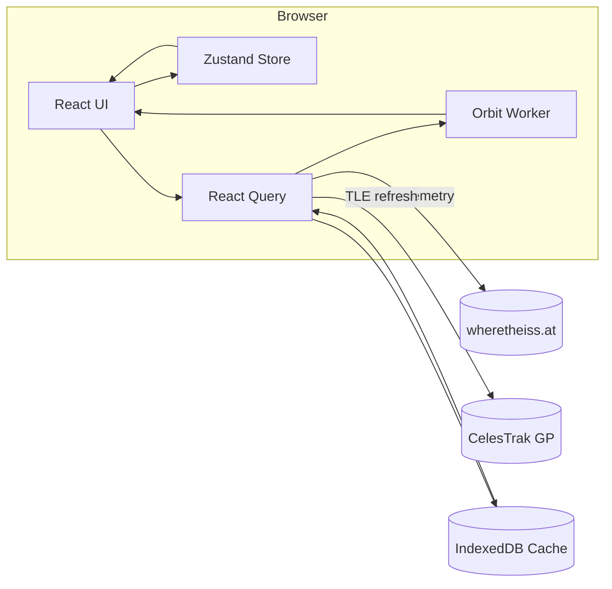
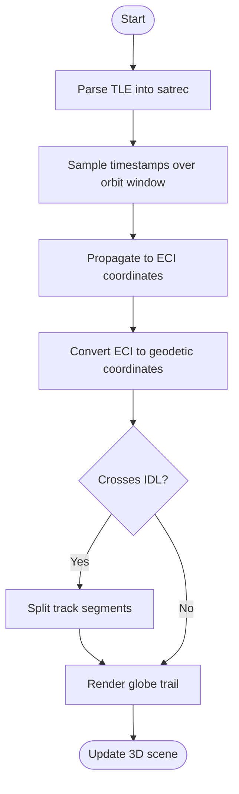

# ISS Tracker — Interactive 3D Globe Experience

A smooth, minimal, highly animated interactive 3D web experience that visualises the **International Space Station (ISS) orbiting Earth in real time**, shows **live location**, **historical/future tracks**, and lets users **check when the ISS will be visible above their location**.

Built with **React 18**, **Vite 5**, **Bun**, **three.js**, **@react-three/fiber**, and **satellite.js** for SGP4/SDP4 orbit propagation.

## Features

### Core Functionality

- ✅ **Live ISS position** updates on a 3D globe at ≤5s cadence (user-toggle 1–10s)
- ✅ **Accurate pass predictions** for any lat/lon using **satellite.js SGP4** propagation from current ISS TLEs
- ✅ **Orbit trail**: last 90 minutes & next 90 minutes arc rendered; user can scrub time ±24h
- ✅ **Performance**: steady **60 FPS** on mid-range laptop (2020+) and **≥30 FPS** on mid-range mobile
- ✅ **Fallback resilience**: if live API is unavailable, app falls back to latest cached TLE and propagates locally

### Technical Highlights

- **Pure client-side** orbit propagation using SGP4/SDP4 algorithms
- **Web Worker** for heavy pass computations (keeps main thread smooth)
- **Exponential backoff** for API rate limiting
- **TLE caching** (6-hour TTL) from CelesTrak
- **International Date Line** handling for ground tracks
- **Accessibility**: keyboard navigation, WCAG 2.1 AA contrast, screen-reader labels

## Quickstart

### Prerequisites

- Bun ^1.0.0 (or Node.js ^20.11.1)

### Installation

```bash
bun install
```

### Development

```bash
bun run dev
```

Open [http://localhost:3000](http://localhost:3000) to view the application.

### Build

```bash
bun run build
bun run preview
```

## Architecture

### Application Flow



### Data Sources (Free/Public APIs)

- **Live ISS position**: [`wheretheiss.at`](https://wheretheiss.at/w/developer) — no auth required, rate-limited
- **TLE data**: [`CelesTrak GP`](https://celestrak.org/NORAD/documentation/gp-data-formats.php) — no auth required for ISS record
- **People in space** (optional): [`Open Notify`](https://open-notify.org/Open-Notify-API/) — no auth required

**Note**: Open Notify's pass predictions endpoint is currently disabled; we compute passes client-side using SGP4.

### Technology Stack

- **Framework**: Vite 5 + React 18
- **Package Manager**: Bun
- **3D Rendering**: three.js 0.160.x + @react-three/fiber 9.4.x + three-globe 2.x
- **Orbital Math**: satellite.js 5.x (SGP4/SDP4 propagation)
- **State Management**: Zustand 4.x
- **Styling**: Tailwind CSS 3.x
- **Dates**: date-fns 3.x
- **Type Safety**: TypeScript 5.x

### Project Structure

```
iss-edu/
├── src/
│   ├── main.tsx           # Vite entry point
│   ├── App.tsx            # Main React app component
│   ├── components/
│   │   ├── orbital/
│   │   │   ├── GlobeExperience.tsx
│   │   │   ├── IssMarker.tsx        # ISS marker with bob animation
│   │   │   ├── OrbitTrail.tsx       # Past/future orbit trails
│   │   │   └── OrbitalPanorama.tsx
│   │   ├── three/
│   │   │   └── GlobeScene.tsx       # Enhanced 3D scene
│   │   └── ui/
│   │       ├── TelemetryPanel.tsx
│   │       ├── PassList.tsx          # Pass predictions UI
│   │       ├── TimeScrubber.tsx      # Time travel control
│   │       └── HudCards.tsx          # Altitude, speed, lat/lon display
│   ├── lib/
│   │   ├── api/
│   │   │   ├── tle.ts                # TLE fetching & caching
│   │   │   └── telemetry.ts          # Live telemetry fetching
│   │   ├── lib/
│   │   │   ├── propagation.ts       # SGP4 propagation utilities
│   │   │   ├── passes.ts            # Pass prediction algorithms
│   │   │   └── geoutils.ts          # Coordinate transformations
│   │   ├── hooks/
│   │   │   ├── useTleManager.ts     # TLE lifecycle management
│   │   │   └── useLivePolling.ts    # Live polling with backoff
│   │   └── state/
│   │       └── orbit-store.ts       # Zustand store for orbit state
│   └── workers/
│       └── orbit.worker.ts           # Web Worker for pass computations
├── index.html                  # Vite HTML entry
├── vite.config.ts              # Vite configuration
└── package.json
```

## Key Algorithms

### A) Orbit Propagation (SGP4)

1. Parse TLE → `satellite.twoline2satrec`
2. For each epoch `t`: run `satellite.propagate(satrec, t)` → ECI position/velocity
3. Convert to geodetic lat/lon/alt with `satellite.eciToGeodetic` (using GMST)
4. Draw ground track by sampling every 10–15s and stitching polyline; break at IDL to avoid wrap



### B) Pass Predictions

Given observer (φ, λ, h): sweep time forward (e.g., 48h) at 10s steps; compute topocentric position → elevation/azimuth. Detect when elevation crosses 0° (AOS) and back to 0° (LOS); within, track max elevation & time. Compute sun altitude for visibility (e.g., sun < −6° and satellite sunlit). Return next 10 passes.

### C) Live Fallback

If live API fails N times, switch label to "Local propagation (TLE)"; keep animating by advancing epoch with system clock.

## Performance Optimisations

- Static textures compressed (webp/ktx2)
- `react-three-fiber` `dpr={[1, 1.5]}` adaptive for mobile
- Offload SGP4 loops to **Web Worker**; batch compute passes
- `requestAnimationFrame` cadence locked
- Memoised geometries
- Frustum culling + low-poly ISS marker

## Accessibility

- **Keyboard navigation** for major controls
- **WCAG 2.1 AA** contrast ratios
- **Screen-reader labels** for key metrics (lat/lon, altitude, speed, ETA)
- **Reduced-motion mode** respected (`prefers-reduced-motion`)
- **Low-power mode** toggle (caps FPS to 30)

## Configuration

No configuration required to run locally. Optional environment variables:

- `NEXT_PUBLIC_TELEMETRY_INTERVAL`: Default polling interval in seconds (default: 5)
- `NEXT_PUBLIC_ENABLE_ANALYTICS`: Enable local performance metrics (default: false)

## API Contracts

### Internal Worker Messages

```typescript
type WorkerRequest =
  | { type: 'COMPUTE_PASSES'; observer: { lat: number; lon: number; altKm: number }; windowHours: number; tle: string }
  | { type: 'PROPAGATE_TRACK'; start: number; end: number; stepSec: number; tle: string };

type WorkerResponse =
  | { type: 'PASSES'; passes: Pass[] }
  | { type: 'TRACK'; segments: Array<Array<{ t: number; lat: number; lon: number }>> }
  | { type: 'ERROR'; error: string };
```

### Rate Limiting & Caching

- **Live position poll**: default 5s; if 429 → backoff (10→20→40s) for 10 minutes, then resume
- **TLE refresh**: on load and every 6h; ETag/Last-Modified respected

## Deployment

**Static hosting** (Netlify/Vercel/GitHub Pages) since it's a pure client app.

Set cache headers:
- Textures: 1y immutable
- JS: content-hashed
- Live JSON: no-store (if proxied; we don't proxy in v1)

## Documentation

- **Architecture**: See `docs/telemetry-stack.md` for detailed system architecture
- **Runbooks**: See `docs/runbooks/` for operational procedures
- **API Notes**: See inline code comments and JSDoc

## Testing

```bash
# Unit tests
pnpm test:unit

# Integration tests
pnpm test:integration

# Full test suite
pnpm test
```

## License

See [LICENSE](./LICENSE) file.

## References

- [`wheretheiss.at` API](https://wheretheiss.at/w/developer) — Live ISS position
- [`CelesTrak`](https://celestrak.org/NORAD/documentation/gp-data-formats.php) — TLE data source
- [`satellite.js`](https://github.com/shashwatak/satellite-js) — SGP4/SDP4 library
- [`@react-three/fiber`](https://www.npmjs.com/package/@react-three/fiber) — React renderer for three.js
- [`three-globe`](https://github.com/vasturiano/three-globe) — Globe layer utilities

---

Built with ❤️ for space enthusiasts and educators.
